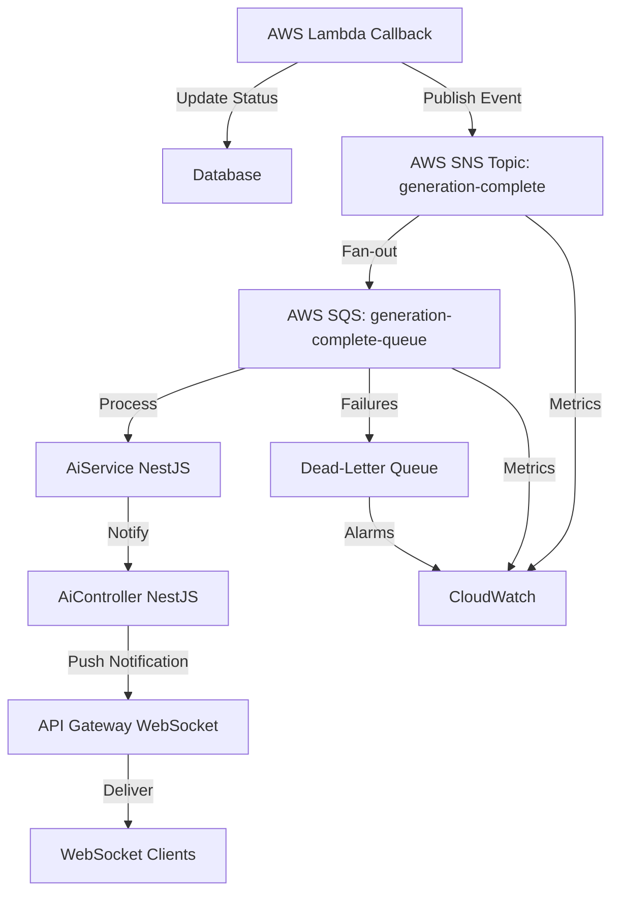

# Example: A Quick Pub/Sub System Design Proposal for Generation Completion Notifications

**Disclaimer**: This proposal is a high-level example of a pub/sub system design for generation completion notifications, prepared in under 2 hours. It is not intended to be fully comprehensive or a final version, but rather a starting point for further refinement and detailed design.

## 1. System Architecture

### Overview
A pub/sub system for AI generation completion notifications, integrating a WebSocket-enabled NestJS application with AWS Lambda and AWS SNS/SQS. The system ensures real-time client notifications via WebSocket.

### Components
- **Publishers**:
  - **AWS Lambda Callback**: Publishes completion events to SNS after updating generation status.
- **Message Broker**:
  - **AWS SNS Topic**: `generation-complete` for fan-out messaging.
  - **AWS SQS Queue**: `generation-complete-queue` for AiService consumption.
- **Subscribers**:
  - **AiService (NestJS)**: Consumes SQS messages and notifies AiController.
  - **AiController (NestJS)**: Manages WebSocket connections and pushes notifications to clients.
- **WebSocket Clients**: Web clients connected via API Gateway WebSocket.
- **Database**: Prisma for generation status updates.
- **API Gateway**: Handles WebSocket connections.

### Flow
1. Lambda callback updates generation status to `COMPLETE` via Prisma.
2. Lambda publishes event to SNS `generation-complete` topic.
3. SNS routes message to SQS `generation-complete-queue`.
4. AiService consumes SQS message and notifies AiController.
5. AiController pushes notification to WebSocket clients via API Gateway.

### System Diagram


## 2. Technology Choices

### AWS SNS + SQS
- **AWS SNS**: Managed pub/sub for high-throughput messaging.
- **AWS SQS**: Ensures reliable message delivery to AiService (Possibly overkill but I'm used to working with queues).
- **Why Chosen**: Scalable, AWS-native, supports decoupling, and integrates with existing Lambda and NestJS.

### API Gateway WebSocket
- Manages persistent WebSocket connections for real-time notifications.
- Scales automatically and integrates with NestJS.

### Alternative: Redis Pub/Sub
- **Pros**: Low latency, simple for real-time.
- **Cons**: No persistence, manual scaling, infrastructure overhead.
- **Why Not Chosen**: SNS/SQS better for reliability and AWS integration.

### Alternative: RabbitMQ
- **Pros**:
  - Flexible message routing with exchanges and queues.
  - Supports persistence and retries.
  - Good for complex workflows.
- **Cons**:
  - Requires managing infrastructure (e.g., EC2 or Kubernetes).
  - Higher operational complexity than SNS/SQS.
  - Less seamless integration with AWS ecosystem.
- **Why Not Chosen**: RabbitMQ's operational overhead and lack of native AWS integration outweigh its flexibility. SNS/SQS are simpler and sufficient for fan-out and reliable delivery.

### Alternative: Apache Kafka
- **Pros**:
  - High-throughput, distributed, and scalable.
  - Persistent message storage for replayability.
  - Ideal for event streaming and large-scale systems.
- **Cons**:
  - Complex to manage (Zookeeper, brokers, partitions).
  - Overkill for simple pub/sub with moderate throughput.
  - Higher cost and expertise required compared to SNS/SQS.
- **Why Not Chosen**: Kafka's complexity and resource demands are excessive for this use case. SNS/SQS provide adequate scalability with lower operational burden.

## 3. Message Format and Schema

### SNS Topic
- `generation-complete`

### SQS Queue
- `generation-complete-queue`

### Message Schema
```json
{
  "prompt": "string",
  "status": "PENDING | COMPLETE | ERROR",
  "imageUrl": "string",
  "imageHeight": 1024,
  "imageWidth": 1024,
  "coreModel": "string",
  "createdAt": "2025-05-19T11:32:00Z",
  "updatedAt": "2025-05-19T11:32:00Z"
}
```

## 4. Error Handling Approach

### Publisher Errors
- **Prisma Update Failure**:
  - Retry 3x with exponential backoff.
  - Log to CloudWatch.
  - Publish `ERROR` status to SNS.
- **SNS Publish Failure**:
  - Retry 3x with backoff.
  - Log to CloudWatch, alert via SNS `error-notifications`.

### Subscriber Errors
- **SQS Processing Failure**:
  - Move to DLQ after 3 attempts.
  - Monitor DLQ via CloudWatch alarms.
  - Manual reprocessing from DLQ.
- **AiService/AiController Failure**:
  - Log to CloudWatch.
  - Notify clients of errors via WebSocket.
- **WebSocket Delivery Failure**:
  - Log disconnected clients.
  - Store notifications for reconnection (if needed).

### Monitoring
- CloudWatch metrics for SNS, SQS, and WebSocket connections.
- Alarms for DLQ size, publish failures, or high latency.

## 5. Scaling Considerations

### Publisher
- **Lambda**: Auto-scales; configure concurrency limits.
- **Prisma**: Optimize queries, scale database if needed (currently Postgres).

### Message Broker
- **SNS**: Serverless, scales automatically.
- **SQS**: Scales with queue depth.

### Subscriber
- **AiService/AiController**: Depends on deployment. I need to investigate further. 
- **API Gateway**: Auto-scales.

### Bottlenecks
- **WebSocket Connections**: Monitor connection limits; use connection pooling.
- **Database**: Use read replicas for high read traffic if necessary.

## 6. Security Considerations

### Authentication and Authorization
- **IAM Roles**: Least privilege for Lambda, NestJS, SNS/SQS access.
- **API Gateway**: Secure WebSocket with JWT or API keys.
- **Data Encryption with AWS KMS**:
  - Manage encryption keys for sensitive data (e.g., user credentials, tokens) in databases or SNS/SQS.
  - Encrypt environment variables in Lambda and NestJS using KMS keys.
  - Restrict KMS key access to authorized IAM roles/services (least privilege).
  - Enable automatic key rotation in KMS.

## 7. Trade-offs and Alternatives

### SNS + SQS vs. Redis Pub/Sub
- **SNS + SQS**: Reliable, scalable, managed.
- **Redis**: Faster but non-persistent, complex to scale.
- **Decision**: SNS/SQS for reliability and integration.

### SNS + SQS vs. RabbitMQ
- **SNS + SQS**: Managed, AWS-native, simple.
- **RabbitMQ**: Flexible but high operational overhead.
- **Decision**: SNS/SQS for lower complexity and AWS integration.

### SNS + SQS vs. Kafka
- **SNS + SQS**: Simpler, cost-effective for moderate scale.
- **Kafka**: Powerful but complex and resource-intensive.
- **Decision**: SNS/SQS sufficient for current needs.

### Direct SNS to AiController
- **Pros**: Simplifies setup, reduces latency.
- **Cons**: No persistence, harder to retry.
- **Decision**: SQS for guaranteed delivery.

## 8. Implementation Plan

### Phase 1: Infrastructure
- Set up SNS topic, SQS queue, and DLQ.
- Configure IAM roles and KMS encryption.
- Update Lambda to publish to SNS.

### Phase 2: NestJS
- Implement SQS consumer in AiService.
- Add WebSocket support in AiController.
- Integrate with API Gateway WebSocket.

### Phase 3: Testing
- Test end-to-end flow (Lambda → SNS → SQS → AiService → AiController → Client).
- Simulate failures for DLQ and retry validation.

### Phase 4: Monitoring
- Set up CloudWatch metrics/alarms for SNS, SQS, WebSocket.
- Monitor WebSocket connection stability.
